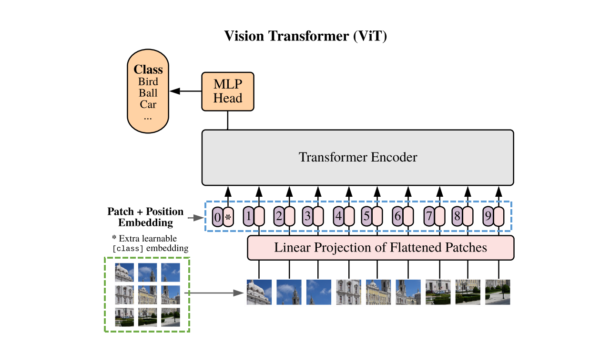

# alpaco0304
 
# CNN모델과 플라스크를 이용한 MNIST 학습

- Github Url : <a>https://github.com/lee-hyeon-gu/alpaco0304/<a>

1. 수행기간 : 2023년 1월부터 2월까지
2. 수행기관 :  알파코 딥러닝 부트캠프
3. 데이터 : 데이터는 0\~9의 숫자 이미지로 이루어진 MNIST train 6만장 test 3만장으로 사용하였다. 
---

![output]|
결과 이미지output.jpg|전체 설계도 architecture.jpg

4. 참고문헌 : Krizhevsky, Alex, Ilya Sutskever, and Geoffrey E. Hinton. "Imagenet classification with deep convolutional neural networks." Advances in neural information processing systems 25 (2012)
5. 느낀점 : CNN으로는 0\~9 이미지의 학습 성능이 잘 나왔지만 transform을 어떻게 주냐에 따라서 성능을 감소시키는 기법들이 뭐인지 리포트하고 싶었다.
